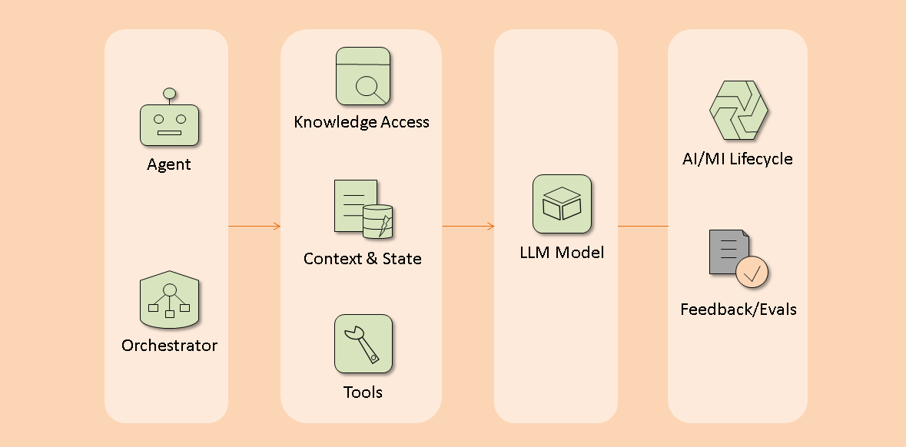
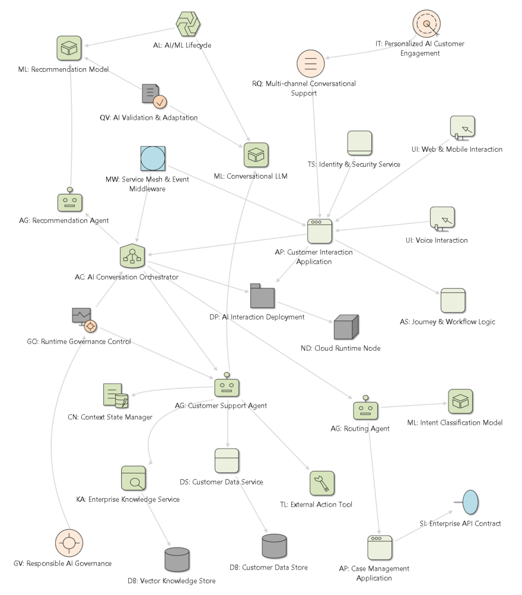
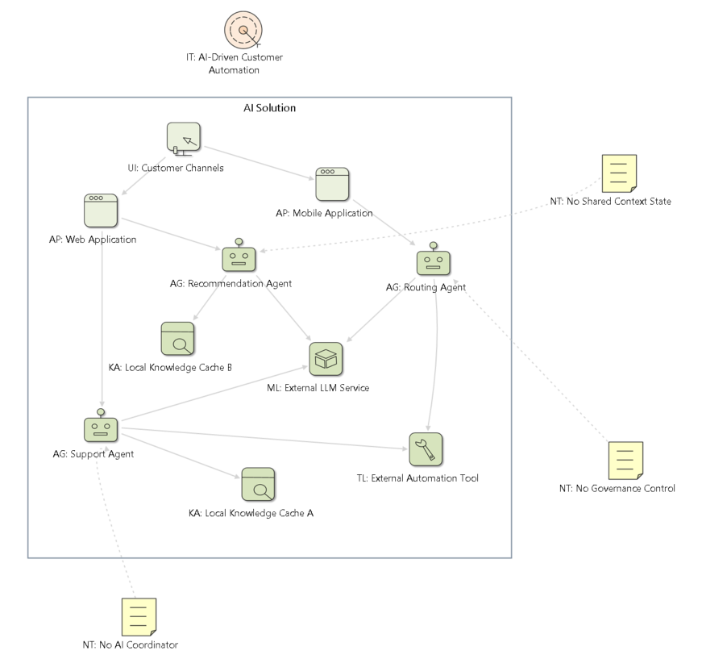
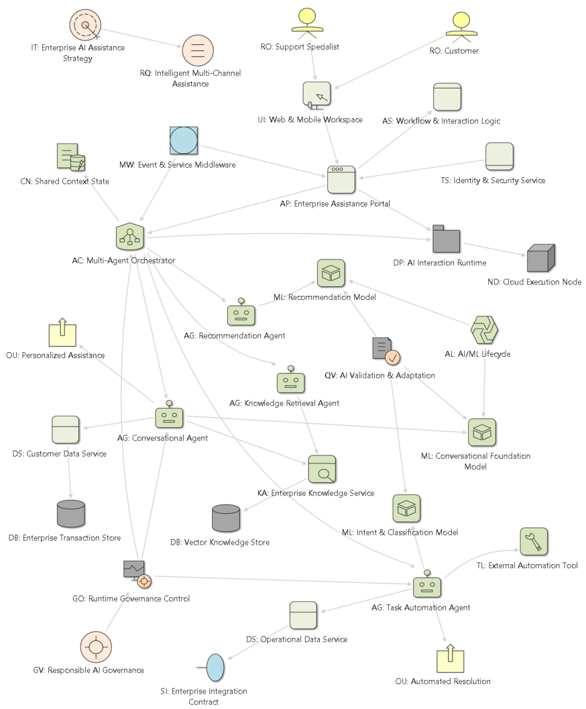
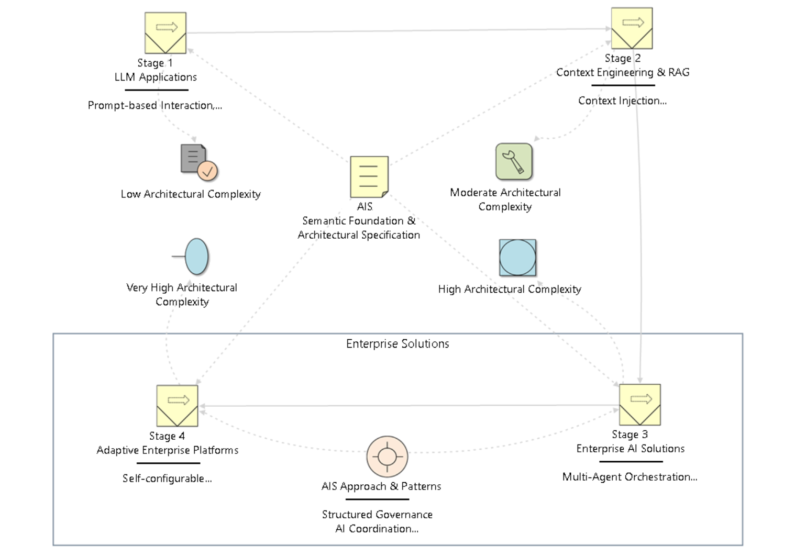

# AIS (AI Solution) Architectural Approach and Application Pattern

---

## Overview

Many organizations are adopting AI without a clear understanding of how to integrate and absorb it into their broader ecosystem. The *AI Solution (AIS) Architectural Approach*, abbreviated as AIS architecture, provides blueprint-level architectural maps that can be implemented in AI solutions serving business objectives. These approaches are governed by the AIS model specification to ensure shared understanding among key stakeholders and to enable consensus through a common architectural language.

## AIS Architectural Approach

AIS architecture is an architectural operationalization approach for AI-native enterprise solutions governed by AIS model abstractions. In simple terms, AIS architecture represents an AI-native architectural orientation for adaptive solutions that goes beyond prompts, agents, AI tooling, and isolated AI implementations.

It emphasizes:

- **AI-first architectural adoption:** autonomous orientation and execution within defined architectural constraints

- **Governance abstraction:** focusing on validation and adaptation, including feedback loops, continuous learning, semantic alignment, AI/ML lifecycle considerations as part of solution management, and architectural guardrails

- **Architectural coordination:** agentic orchestration and sustainability under large-scale AI system complexity

- **Data-centric architecture:** centering on AI and data architecture, including data input and sources, transformation, storage, and management. It also considers key data services such as data orchestration, model reasoning capabilities, knowledge access, context management, data APIs, intent awareness, and data validation loops to better serve enterprise business needs

## AIS Arch Modeling Elements

As an AI-native architectural approach, AIS Arch focuses on AI-specific elements, as shown in the following list (Figure 1). 

*Figure 1: AI-Specific Modeling Elements*

For most AIS solutions, closely related elements - such as input, output, and governance control - as well as non-AI elements not shown in Figure 1, are also used as supplementary elements. For the complete set of AIS modeling elements, refer to the AIS model specification (see this [link](https://github.com/seniorgu/ai-esa/blob/main/docs/ai-esa-specification.md)), on which AIS architecture is based.

If the solution is AI-augmented in nature, the AIS+ (AI-Augmented Solution) architectural approach (see this [link](https://github.com/seniorgu/aasa/blob/main/docs/aasa-specification.md)) can be applied.

In simple terms, both AIS and AIS architectures use AIS model elements for enterprise AI solution modeling, but they differ in focus and application scope. For their relevance and relationship, see the following "Related Model Spec and Architecture" section.   

---

## AIS Architectural Pattern & Example

AIS architectural patterns mean more architectural usage pattern, orchestration pattern, operational topology, governance and architectural mapping patterns, rather than software design patterns or normative architectural style patterns.

### An AIS Pattern Example

Note from the Figure 2 pattern example, AI-native still requires app logic, data services, and technical services. but they are NOT the architectural center of gravity.

*Figure 2: AIS Pattern Example*

### An Anti-Pattern Example

Figure 3 shows an “Isolated Agent Chaos” anti-pattern. This pattern shows that AI-native systems are not merely collections of agents. They require orchestration context continuity, governance, and operational control.

*Figure 3: An Anti-Pattern Example*

### AIS Canonical Example

Figure 4 shows a canonical example of AIS architectural pattern for an AI-Native Enterprise Assistance Platform.

*Figure 4: AIS Canonical Pattern Example*

Unlike general reusable patterns, the canonical pattern focuses on holistic architectural composition and illustrates how multiple patterns can coexist coherently within a unified architectural structure.

---

## Architectural Concerns

AIS architecture helps clarify architectural solution concerns in the following areas:

- agent coordination, and adaptive workflows,

- context management, and operational memory,

- hallucination containment, and trust boundaries,

- governance observability, and human override,

- semantic consistency, and AI lifecycle sustainability

### Human-AI Responsibility Boundary

Based on common understanding, the human–AI responsibility boundary can be listed as follows:

- delegation boundary,

- decision authority,

- architectural override,

- accountability mapping,

- confidence threshold handling,

- escalation patterns.

---

## Roadmap to AIS Architecture 

*Figure 5: Roamap to AIS Architecture*

As shown in Figure 5, AI solutions typically begin with LLM applications, then evolve into context engineering and RAG-based systems. This is followed by enterprise solutions, including enterprise-grade multi-agent orchestration, business-context-aware harness engineering, and future self-configurable enterprise platforms. AIS architecture is most applicable in this enterprise stage, where architectural complexity increases and requires structured governance, coordination, and abstraction.

Each of the stage focuses on:

- *Stage 1*: Prompt-based Interaction, Standalone AI Usage, and Basic AI Assistance

- *Stage 2:* Context Injection, Semantic Retrieval, Knowledge Grounding, and Memory & State

- *Stage 3*: Multi-Agent Orchestration, Business Context Harnessing, Workflow Coordination, and Enterprise Integration

- *Stage 4*: Self-configurable Systems, Autonomous Optimization, Dynamic Governance, and Continuous Architectural Adaptation

## Related Model Spec and Architecture

AIS architecture uses the AIS model specification and maintains a close relationship with AIS+ (AI-Augmented Solution Architecture).

For the relationship and relevance among AIS model, AIS architecture, and AIS+ architecture, see this [link](https://github.com/seniorgu/ai-esa/blob/main/docs/relationship-of-ai-esa-to-aisa-and-aasa.md).
