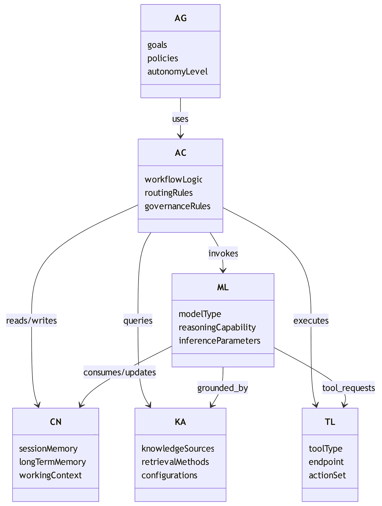
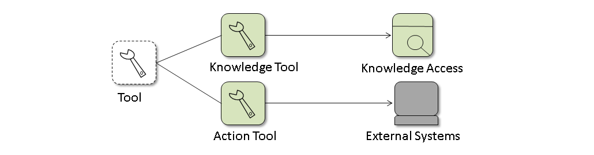
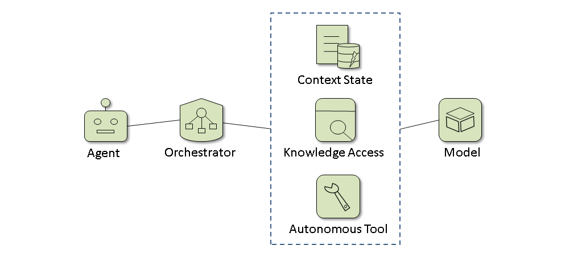
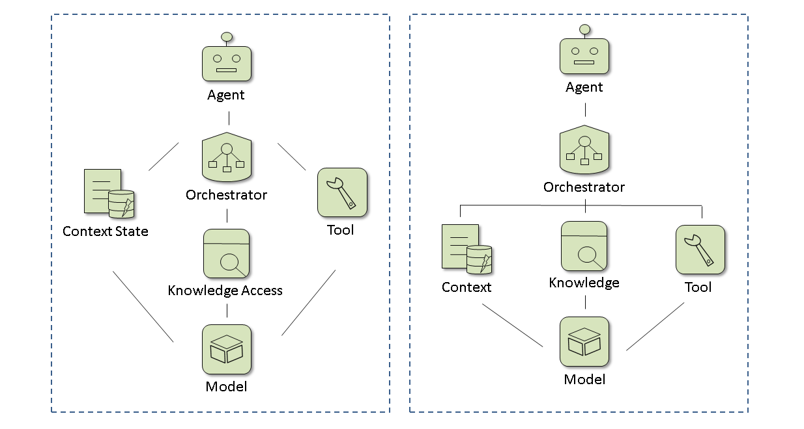

# FAQs on the TOCKAM Metamodel

This page concentrates on frequently asked questions about the metamodel of the TOCKAM - the key AI-specific elements in the AI solution architecture (ASA).

## What's the general interpretation of TOCKAM element relationship?

Table 1 shows a TOCKAM relationship with cardinality and a brief interpretation.

| Relationship                      | Cardinality                                                   | Meaning                                                                                                                                        |
| --------------------------------- | ------------------------------------------------------------- | ---------------------------------------------------------------------------------------------------------------------------------------------- |
| Agent ↔ Orchestrator              | AG 1..* ----uses---- 1 AC \| AC 1 ----coordinates---- 0..* AG | An Agent executes business goals. \| The Agent delegates workflow control to the Orchestrator. \| An Orchestrator may support multiple Agents. |
| Orchestrator ↔ Model              | AC 1 ----invokes---- 1..* ML                                  | Orchestrator selects models. \| Routes prompts.\| Manages inference execution.\| Supports model switching and fallback.                        |
| Orchestrator ↔ Context Management | AC 1 ----manages---- 1 CN \| CN 1 ----serves---- 1..* AC      | Retrieves conversation state. \| Stores intermediate reasoning. \| Maintains session memory. \| Manages long-term memory references.           |
| Orchestrator ↔ Knowledge Access   | AC 1 ----queries---- 0..* KA                                  | Retrieves enterprise knowledge. \| Executes RAG. \| Accesses policies and configurations. \| Resolves grounding information.                   |
| Orchestrator ↔ Tools              | AC 1 ----uses---- 0..* TL                                     | Calls APIs. \| Executes workflows. \| Invokes external services. \| Performs actions.                                                          |
| Model ↔ Context                   |                                                               | Context becomes model input. \| Model outputs may update memory.                                                                               |
| Model ↔ Knowledge Access          |                                                               | Retrieved documents. \| Knowledge graphs. \| Vector search results. \| Policy repositories.                                                    |
| Model ↔ Tools                     |                                                               | Function calling. \| Tool selection. \| Agentic execution. \| Usually mediated by the Orchestrator.                                            |

*Table 1: TOCKAM relationship*

*Figure 1: General TOCKAM Metamodel*

## What's the clear responsibilities of TOCKAM?

Table 2 shows TOCKAM responsibilities. This structure scales well from simple copilots to multi-agent.

enterprise AI systems.

| Element           | W/H               | Responsiblity         |
| ----------------- | ----------------- | --------------------- |
| Agent             | Why               | Goal                  |
| Orchestrator      | How               | Coordination          |
| Context           | What is known now | State/Memory          |
| Knowledge Service | What can be known | Enterprise Knowledge  |
| Model             | How to reason     | Intelligence          |
| Tool              | How to act        | External Capabilities |

*Table 2: TOCKAM responsibilities*

## Can Tools be part of Context Management (CN) or Knowledge Access (KA)?

Short answer: Some tools can be modeled as specialized KA or CN capabilities, but not all tools. For a general AI metamodel, I would keep the tool (TL) as a first-class element.

Why separate TL from KA and CN? A tool is fundamentally an action interface: Tool = capability that can be invoked. Examples:

- Search API
- SQL query engine
- CRM update API
- Email sender
- Calendar creator
- Python execution
- Web browser

Some tools are used specifically for knowledge retrieval:

- Vector Search Tool
- Document Search Tool
- Graph Query Tool

These are effectively enabling Knowledge Access. 
Likewise, some tools manage memory:

- Memory Read Tool
- Memory Write Tool
- Context Summarizer

These support Context Management.

**Option A – Keep TL Separate (Recommended)**

*Figure 2: Tool - Option A*

Advantages:

- Cleaner separation
- Knowledge is a resource
- Tool is a mechanism

Example:

- KA = Enterprise Knowledge Base
- TL = Vector Search API

The knowledge exists independently of the tool.

**Option B – Make TL a Generalization Layer**

*Figure 3: Tool - Option B*

This is common in agent frameworks.

**Option C – Absorb Tools into KA and CN**

*Figure 4: Tool - Option C*

Then TL disappears.
This works for simpler architectures, but becomes problematic when you add:

- Email sending
- Workflow execution
- ERP updates
- Robotics actions

Those are not really knowledge or context.

## Can the Model (ML) be at the Bottom?

I think this is a stronger representation of modern agentic AI.
Let's take a look at how the model is placed differently from Figure 1.

###### Traditional  AI Architecture

 *Figure 5: Model - Traditional AI Arch*

This treats the model as just another service.

##### Foundation-Oriented Architecture

In reality:

- Agents emerge from models
- Tool selection is model-driven
- Reasoning is model-driven
- Memory interpretation is model-driven
- Knowledge grounding and knowledge grounding are model-driven

Therefore, the medamodel looks like:

*Figure 6: Model - Foundation-oriented Arch*

The two relationships in Figure 6 are very similar structurally; the difference lies mainly in the meanings they emphasize. The first emphasis is on the *Network / Dependency View* (runtime collaboration), and the second is on the *Layered View* (capability view). 

Another alternative is to make *Orchestrator* (AC) the broker, as seen in many agent architectures. In that case, AC itself represents:

- routes requests
- selects tools
- invokes retrieval
- manages memory

The model becomes the cognitive substrate.

- CN supplies state to ML
- KA supplies knowledge to ML
- TL supplies capabilities to ML
- AG and AC emerge from ML-driven behavior

This aligns well with how current LLM-based systems operate.

## If any of the element is removed from TOCKAM, can the AI system still run?

Well, this touches on the runtime. Table 3 shows practical rules for the runtime requirement of each element.

| Element | Runtime Required? |
| ------- | ----------------- |
| AG      | Yes               |
| AC      | Yes               |
| CN      | Usually           |
| KA      | Usually           |
| TL      | Usually           |
| ML      | Yes               |

Table 3: Practical rules for a useful test

For the runtime requirement, other than TOCKAM elements, governance control (not an AI-specific element, though) is also required. But the AI/ML lifecycle element (an AI solution architecture element including training, evaluation, and deployment pipelines) is not required, though it's an AI-specific, closely related to the model element.

## Why is "planning" not considered part of an AI-specific element?

Planning is typically a behavior or capability. Agent, for example:

- Goal Management
- Task Decomposition
- Planning
- Reflection
- Decision Making

The planning is considered as part of the coarse-grained, non-AI-specific "task" element in the AI solution architecture model specification; the same is true with other intent and metric elements, such as decision (key choice), and intent elements.

Similarly, many AI concepts and common terms are not normally used in architecture, such as:

- Reasoning
- Prompt construction
- Tool selection

But they will be reflected from related model elements. For example, *reasoning* is expressed by the AI Model element, and *tool selection* is considered by the Decision element.

## What is the typical transition between AI-specific and non-AI elements?

Simple answer:

**AI Domain**: AG → AC → CN/KA/ML → TL 

- Goal-driven                   
- Context-aware                 
- Dynamic                
- Adaptive 

*Decision Handoff to* 

**Traditional Domain**: PS (traditional process) → AS (app logic) → DS (data service → SY (system)

- Rule-driven                  
- Deterministic    
- Transactional                 
- Auditable  

This is typically the architecture pattern that scales best in enterprise solution architecture.

## What is the fundamental difference between AI-specific and non-AI elements?

The fundamental difference between AI-specific and non-AI elements: autonomy vs. automation.

> Automation is linear (If-This-Then-That); Autonomy is recursive (Goal-Seeking)

## What are the common, simple definitions and differences between AI tools, AI agents, and agentic AI?

Generally, AI Tools have a narrow scope, limited to a specific function. AI Agents have a relatively broad scope, operating autonomously across contexts. Agentic AI is a commonly used multi-agent ecosystem composed of specialised agents that collaborate with one another or are orchestrated.
